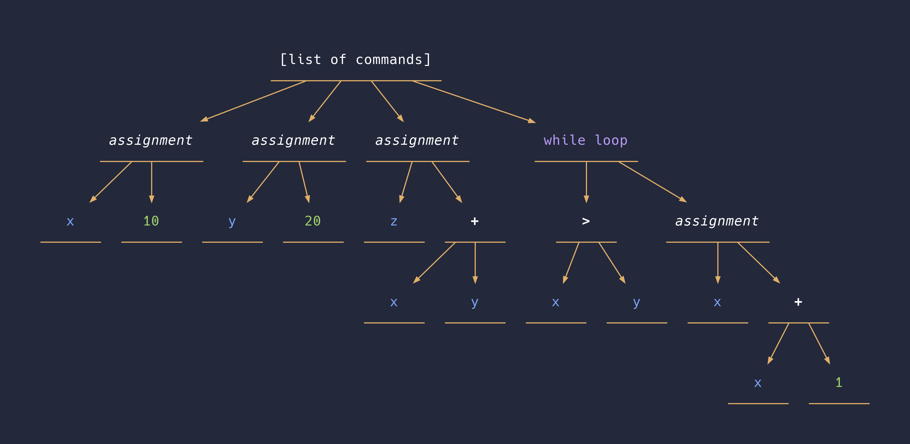
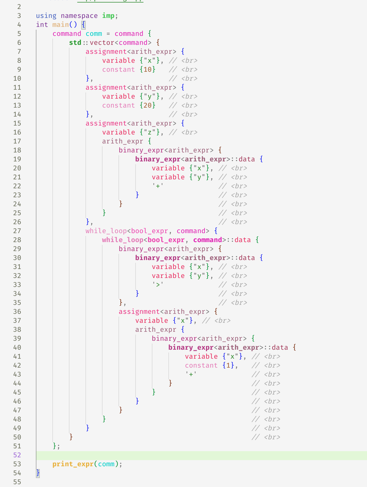

# Imp Code Generator

A simple compiler for the IMP programming language

## Team
Alecto Perez
Jorge Loredo
David Arredondo

## Languages
C++ 
Python 

## How to build the project (including dependencies):
1. 	Make sure gcc-11 is installed https://www.linuxfromscratch.org/blfs/view/svn/general/gcc.html
2. 	
```bash
./install-dependencies.sh
```
3. 
```bash
./build.sh
```

The ‘install-dependencies.sh’ script will install the following dependencies. 

•	Noam parser combinator library
•	RVA recursive variant library
•	Fmtlib (C++ library for printing)
•	Catch2 library for printing
•	tuplet library (fast tuple type implementation)

The 'build.sh' script will invoke CMake and download any dependencies that aren't found on the
system.

## Example

Output of running `build/ast_printing_test`, which prints the syntax tree when
piped to graphviz:



Corresponding syntax tree:


